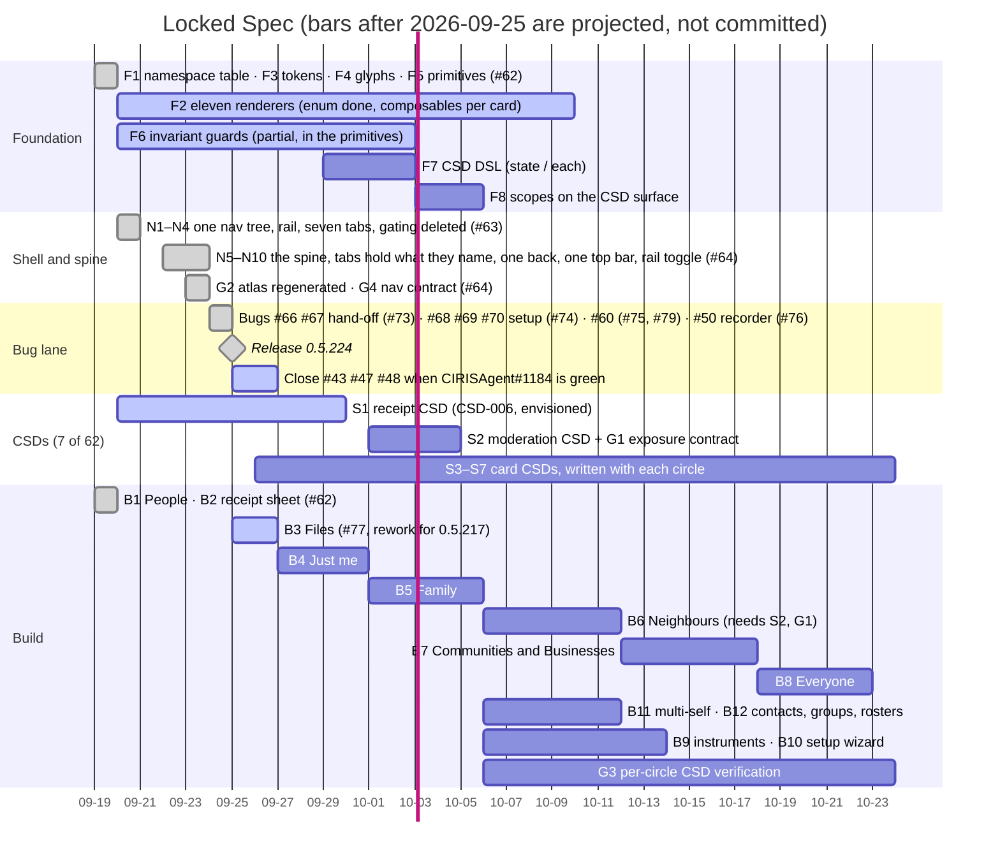

# Locked Spec: roadmap

The order the client redesign is built in, and where it stands. **Updated 2026-09-25.**

This file is the Gantt. The two Gantt artifacts were deleted, and the plan now lives here and in
backlog issue #71. The Card Atlas, the execution plan and the handoff are still the design's own
documents; this page records only what order they are built in and how far along each part is.
The item IDs (F, S, N, B, G) are the execution plan's.

## Where we are

- **Done:** foundation, shell and spine, and the bug lane. Waves 0 and 1, the spine (#64) and every
  client bug the lane named are merged and **released in 0.5.224** (2026-09-25).
- **In review:** B3 Files (#77). It needs one pass for server 0.5.217, below.
- **Next:** B4 Just me, then B5 Family. The server shipped what both need on 2026-09-25.

## Plan against actual

| | item | status | where |
|---|---|---|---|
| F1 | Bind the namespace (122-entry dimension table, generated) | **done** | #62 |
| F2 | Eleven renderers | **partial**: the `Renderer` enum and mapping exist; the composables are written per card as circles land | #62 |
| F3 | Token set + colour-literal lint | **done**; the baseline ratchets toward 0 per circle | #62 |
| F4 | Icon set (71 glyphs) | **done** | #62 |
| F5 | Nine primitives | **done** | #62 |
| F6 | Invariant guards | **partial**: CardShell never nests, error never looks like empty, no hamburger without a receipt | #62 |
| F7 | CSD DSL (`state`, `each`) | not started | — |
| F8 | `scopes:` on `csd:surface` | not started (after F7) | — |
| N1–N4 | One nav tree, the rail, the seven-tab frame, gating deleted | **done** | #63 |
| N5–N10 | The spine | **done** | #64 |
| S1 | Receipt CSD | **envisioned** (CSD-006) | — |
| S2 | Moderation CSD | not started; must come before B6 | — |
| S3–S7 | Card CSDs | **2 of 60**: Files (CSD-007, S3) and People (CSD-005, S6), plus four pre-redesign card CSDs (001–004) to rebind | #62, #77 |
| B1 | Proof screen: People | **done** | #62 |
| B2 | Receipt sheet | **done** | #62 |
| B3 | Files | **in review** | #77 |
| B4–B8 | The five circles | not started | — |
| B9 | Instruments | **partial**: My things pages exist and name their instrument | #64 |
| B10 | Setup wizard, new shape | not started; the bug fixes (#73, #74) landed in the old shape | — |
| B11 | Multi-self | not started, **now unblocked** | — |
| B12 | Contacts, groups, rosters | not started, **now unblocked** | — |
| G1 | Moderation exposure contract | not started | — |
| G2 | Atlas against the new IA | **done** | #64 |
| G3 | Per-circle CSD verification | not started (needs F7) | — |
| G4 | Nav contract (49/49 hops) | **done** | #64 |

## CSDs: 7 written, 62 planned

The plan is one CSD per card: S1 receipt 1 · S2 moderation 1 · S3 universal ×9 · S4 divergent ×7 ·
S5 new ×16 · S6 identity, rosters, ledgers ×14 · S7 instruments and flows ×14 = **62**.

| CSD | card | stage | plan slot |
|---|---|---|---|
| 001 | Delegation | sketched | pre-redesign; rebind to its circle |
| 002 | Environment | sketched | pre-redesign; rebind |
| 003 | Constitutional (the accord) | sketched | pre-redesign; lives under Everyone › Safety |
| 004 | Capacity attestations | sketched | pre-redesign; rebind |
| 005 | People | sketched | S6 |
| 006 | Receipt | envisioned | **S1** |
| 007 | Files | sketched | S3 |

None is at `building`. The rule stands: a circle is not shipped until its CSDs verify (G3), so each
circle's CSDs are written with the circle, not in a batch ahead of it.

## Has the other side shipped what each lane needs?

**Server: mostly yes, as of 0.5.216 and 0.5.217 (2026-09-25).**

| lane | needs | state |
|---|---|---|
| B3 Files | drive plane, CRUD (rename, replace, move, withdraw, `/meta`, paging, 64 MiB uploads), write gate, `/v1/media/policy`, plaintext `content_digest` | **shipped** (0.5.215–0.5.217). Open: renditions (CIRISServer#614), a digest signed into the row (#641, CIRISEdge#638), bytes on the owner's other devices (CIRISEdge#646, CIRISServer#604) |
| B4 Just me | notes, own devices (`/v1/self/occurrences`, labels, release), self files | **shipped** (0.5.216) |
| B5 Family | `/v1/families` (create, roster, roles, quorum changes), family files | **shipped** (0.5.216). Gaps: roster changes after creation don't replicate, and a removed member can't be re-added (CIRISPersist#910) |
| B6 Neighbours | `/v1/communities`, `/v1/safety/moderation`, `/v1/safety/watchlist`, named moderators | **routes exist**. Gap: a member added after creation is refused reads (CIRISPersist#907). The client-side S2/G1 come first |
| B7 Communities and Businesses | affiliations tier, commons standing | **partial**: `tier: affiliations` and `/v1/commons/standing` exist; **no routes for terms, ledgers or the group book** |
| B8 Everyone | trust roots, the accord, commons ballots and objections | **routes exist**. Open: `/v1/accord-holders` serves the trust root unsigned (CIRISServer#248). **No route for shared knowledge** |
| B11 multi-self | own devices, self content on each device | rows **shipped** (CIRISPersist#884 closed); bytes wait on CIRISEdge#646 |
| B12 contacts, groups | contacts with their `grant` envelope, families, communities, the cosign ceremony | **shipped**. Holder count: CIRISServer#616 |
| People receipt | the grant's envelope on `/v1/contacts` | **shipped** in 0.5.213; the client doesn't read it yet |
| file authorship | a file signed by the person, not the node | open: CIRISEdge#675 ("author only" works only from the writing device) |

**Agent: what the client needs is in flight.** CIRISAgent#1184 pins server 0.5.217 and client
0.5.224, and its five-platform run is pending. That run closes the hand-off family (#43, #47,
#48). Also open: CIRISAgent#1181 (the runner's nav hops for the new shell) and #1193–#1196 (the
four setup bugs on the agent side). None of them blocks B3–B5.

## B3: one pass before merge

Server 0.5.217 changed what #77 should do:
1. The write gate refuses a file whose bytes contradict its declared type, including a real JPEG
   sent as `application/octet-stream`. That is what #77 sends when a picker reports no type. Fix:
   declare the type sniffed from the bytes.
2. Uploads go up to 64 MiB. Read the caps from `/v1/media/policy`, not the compiled-in 1 MiB.
3. `content_digest` is on the open-file response, so verify it (CC 5.3.2.5) before anything renders.
4. Name the note-only `unreadable` state.
5. Bundle the 0.5.216 and 0.5.217 message ids (#78; #65 is already in #77).

## Deferred on purpose

- Geist / Geist Mono: the type scale ships on system faces until compose-resources fonts are proven
  on the iOS leg.
- The 13 accent themes stay until the per-circle work decides what to do with them.
- Image, audio and video previews: renditions only (`FSD/MEDIA_EDGE.md` §7), after CIRISServer#614.
