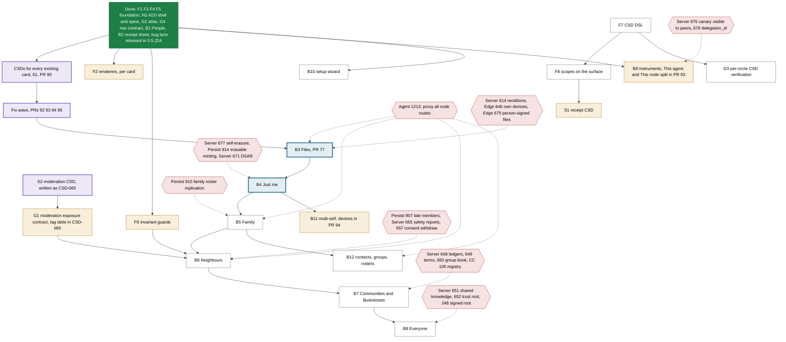

# Locked Spec: roadmap

The order the client redesign is built in, and where it stands. **Updated 2026-09-25 (evening).**

This file is the plan. It tracks dependencies, not dates. The two Gantt artifacts were deleted,
and the plan now lives here and in backlog issue #71. The Card Atlas, the execution plan and the
handoff are still the design's own documents; this page records only what order they are built in
and how far along each part is. The item IDs (F, S, N, B, G) are the execution plan's.

## Where we are

- **Released:** client **0.5.224** carries the whole bug lane, and CIRISAgent#1184 (server 0.5.217
  plus client 0.5.224) merged green. #43, #47 and #48 are closed against it.
- **Every existing card has a CSD:** 61 in #90, plus CSD-007 in #77. The tier question is settled:
  no new circle. The "This node" instrument splits into **This agent** and **This node**
  (`FSD/AGENTS_AND_NODE_TIER.md`).
- **In review: the fix wave the CSDs found**, four PRs that are all mergeable and green:

  | PR | what |
  |---|---|
  | #92 | nav disposition, drivable fields, one-press node final step, derived flow-only list (five-platform passed) |
  | #93 | This agent / This node, and the agent-only flags corrected |
  | #94 | device labels, revoked devices, release a node (0.5.216) |
  | #95 | twelve cards stop showing a failed read as empty or healthy |

  #92 and #93 both touch `testing/gate/nav_map.py`: merge #92 first.
- **Next:** B3 Files (#77: conflicting, and it needs the 0.5.217 pass below), then **B4 Just me**,
  then **B5 Family**. Families and communities (18 node routes, 0.5.216) are shipped and entirely unused.
- **The one upstream item that reaches every lane** is **CIRISAgent#1213**. The agent proxies only 4 of
  the node's prefixes, so on a with-AI install contacts, drive, notes, families, communities, safety and
  admin all 404. The client can route node-owned calls to the node URL (as accord already does)
  without waiting for it.

## Dependencies

Arrows read "must come before". Upstream items (red hexagons, dotted arrows) are what another repo
still owes: the lane can start, but can't fully close without it. Done work is folded into the one
green box.

Green = done · purple = in review · amber = partial · blue outline = next · white = not started ·
red hexagon = owed upstream.

## Plan against actual

| | item | status | where |
|---|---|---|---|
| F1, F3, F4, F5 | namespace table, tokens + lint, glyphs, primitives | **done** | #62 |
| F2 | eleven renderers | partial: the enum and mapping exist; composables are written per card | #62 |
| F6 | invariant guards | partial | #62 |
| F7, F8 | CSD DSL (`state`, `each`); `scopes:` | not started. Meanwhile #90 made `check_csd_v3` reject unknown surface keys and check `flow_only` | #90 |
| N1–N10 | nav tree, rail, tabs, gating deleted, the spine | **done** | #63, #64 |
| S1 | receipt CSD | envisioned (CSD-006) | — |
| S2 | moderation CSD | **written** (CSD-065, with G1's 11-row tag table) | #90 |
| S3–S7 | card CSDs | **every existing card covered**: 61 in #90 plus CSD-007; 56 sketched, 5 envisioned. New cards (S5) are written with their circles | #90, #77 |
| B1, B2 | People, receipt sheet | **done** | #62 |
| B3 | Files | in review, needs the 0.5.217 pass | #77 |
| B4–B8 | the five circles | not started | — |
| B9 | instruments | partial: This agent / This node split in review; the node self-standing card is CSD-045 (envisioned) | #93, #90 |
| B10 | setup wizard, new shape | not started; drivability and one-press fixes in review | #92 |
| B11 | multi-self | partial: device labels, revoked devices, release in review | #94 |
| B12 | contacts, groups, rosters | not started, unblocked (families and communities shipped) | — |
| G1 | moderation exposure contract | partial: tags specified in CSD-065, not yet in code | #90 |
| G2, G4 | atlas; nav contract | **done** | #64 |
| G3 | per-circle CSD verification | not started (needs F7) | — |

## Upstream: what each lane is waiting on

Filed today unless noted. The whole list, with verification, is in #90's body.

| lane | owed | issues |
|---|---|---|
| **every lane, with-AI installs** | proxy every node route | **CIRISAgent#1213** |
| B3 Files | renditions; a signed digest; bytes on your own devices; files signed by the person | Server#614, #641, Edge#646, Edge#675 |
| B4 Just me | erase yourself from the app; erasable minting; DSAR without an agent | Server#677, **Persist#914**, Server#671, Agent#1207 |
| B5 Family | roster changes replicate; re-add a removed member | Persist#910 |
| B6 Neighbours | late community members can read; a non-duty-holder can report; consent can be withdrawn | Persist#907, Server#665, Server#657 |
| B7 Communities and Businesses | ledgers, terms, group book; the missing registry families | Server#648, #649, #650, CC#105 |
| B8 Everyone | shared-knowledge directory; re-rooting from a phone; a signed trust root | Server#651, #652, #248 |
| B9 This node | the compulsion declaration visible to peers; the owner's delegation id | Server#675, #676 |
| cross-cutting | the 33 CSD asks (privacy, consent, conformance) and 5 CC vocabulary conflicts | Server#655–#671, Agent#1202–#1212, CC#106–#110 |

**Shipped upstream and unused by the client:** households and communities (18 routes), drive CRUD
(rename, move, withdraw, `/meta`), `/v1/media/policy`, content digests, peer key verification
(`/peers/{id}/sas`), trace erasure, the Tier S self-standing routes, `/v1/vocabulary` and
`/v1/operations`. Full table: the route-coverage report behind #90.

## Client backlog outside the lanes

- Open since the bug lane: #50 (iOS SIGABRT; 0.5.224 now writes a Kotlin crash log to read on the
  next failure), #51 (logout on a phone with no agent; addressed by #64, needs a phone check), #39,
  #33, #65, #78.
- **Transferred in from CIRISServer today (#80–#89, #91):** stale LLM checks, the dead-`:8080`
  Play Integrity post, failing vendored unit tests, English picker titles, the FOREIGN_ALPHABET ratchet,
  node trust from CEG state, the test-automation audit, the §4.5.13 reveal loop and content hooks,
  secure storage surviving an identity wipe, and the mesh app parity item (#88). Not yet triaged
  into lanes.
- From the CSDs, not yet in a PR: Account vs Settings (a separate `Screen.Account`), Chats empty in
  four circles, `btn_claim_node_*` empty lambdas, about 150 text fields without an input sink, a
  line-citation check for `FSD/CSD`.

## B3: one pass before merge

Server 0.5.217 changed what #77 should do:
1. The write gate refuses a file whose bytes contradict its declared type, including a real JPEG
   sent as `application/octet-stream`. That is what #77 sends when a picker reports no type. Fix:
   declare the type sniffed from the bytes.
2. Uploads go up to 64 MiB. Read the caps from `/v1/media/policy`, not the compiled-in 1 MiB.
3. `content_digest` is on the open-file response, so verify it (CC 5.3.2.5) before anything renders.
4. Name the note-only `unreadable` state.
5. Route drive and notes calls to the node URL, or they 404 on with-AI installs (CIRISAgent#1213).
6. Bundle the 0.5.216 and 0.5.217 message ids (#78; #65 is already in #77).

## Deferred on purpose

- Geist / Geist Mono: the type scale ships on system faces until compose-resources fonts are proven
  on the iOS leg.
- The 13 accent themes stay until the per-circle work decides what to do with them.
- Image, audio and video previews: renditions only (`FSD/MEDIA_EDGE.md` §7), after CIRISServer#614.
