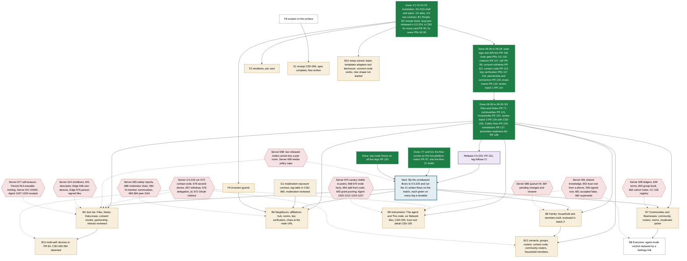

# Locked Spec: roadmap

The order the client redesign is built in, and where it stands. **Updated 2026-09-29.**

This file is the plan. It tracks dependencies, not dates. The two Gantt artifacts were deleted,
and the plan now lives here and in backlog issue #71. The Card Atlas, the execution plan and the
handoff are still the design's own documents; this page records only what order they are built in
and how far along each part is. The item IDs (F, S, N, B, G) are the execution plan's.

## Where we are

- **Released:** client **0.5.224** is still the latest tag. **0.5.225 is PR #131** (the `VERSION`
  bump and a validated `compat/matrix.json` row: node_min 0.5.168, node_max_tested 0.5.217,
  agent_min_tested 2.12.1, 12 new capability ids, 29 languages × 5,059 keys); the tag follows once
  `build.yml` is green on the merge. It carries everything below. Server **0.5.217** is the latest
  server release; **0.5.218 is not cut**. Agent **2.12.1** shipped CIRISAgent#1213 (the node proxy
  forwards every `/v1` path the agent does not serve itself), and six CSDs say so (#128).
- **79 CSDs** (`FSD/CSD`): **7 testable, 65 building, 5 sketched, 2 envisioned**. New since the
  last pass: CSD-106 membership invitations (envisioned, #137) and CSD-107 Where is this file (#139).
  Before that: CSD-007 Files and CSD-008 Notes to self (#77), CSD-105 This node's
  trust root (#126), CSD-100/101 household and members (#122). CSD-092 (share contact code) is
  now building. **Sketched:** 037 My Identity, 042 Help, 044 Health & Reputation, and 093/094
  (the second-device cards, which wait for server 0.5.218). **Envisioned:** 030 Telemetry, 106 membership invitations.
- **Both review batches are merged.** #124 was runtime, identity, interact, setup, network,
  moderation. **#126** is batch 2: **accord / trust root** (the two unpushed trust-root branches
  folded in, a `TrustRoot` detail with posture, import, un-trust and family history, all at the
  node URL; `canonical/supersede` wired as a real rotate; CSD-105 written), **people / chats** (chat
  and contacts calls at the node URL, rooms of more than two open by id, 0.5.218's
  `unopened_reason` handled), **consent / data** (one owner for the accord-settings write, logout
  clears the previous owner's consent record, four-state watchlist, every irreversible act behind
  a three-fact confirm), **adapters / hubs** (the households dispatcher split so each act has one
  screen; moderators "could not read" distinct from "none"). #129 fixed Codex's five findings on it
  (consent reset races, owner-lookup failure, Enable after a failed read, chat pinned to its node,
  YubiKey probe states); #127 replaced English left in six locale bundles.
- **The cards that were in review are in:** #77 Files and Notes (B3), #121 communities, #122
  households, #123 erasure. `PENDING-CSD-007.md` is folded into CSD-007 and gone.
- **The checks:** route gate on `main` — **uncited routes 2** (121 at #111, 14 after #124),
  duplicate mutating routes 23, baseline current, exit 0. 302 API methods, 294 routes, 79 screens
  (70 reach a route), 824 CSD citations. `:shared:desktopTest` 1276/1276 (#129); `pytest testing/`
  323 (#126).
- **The flow runner is on the matrix (#97)** and **a two-node fixture stands beside it (#130)**:
  a Docker-free second `ciris-server` on 5242/5243 per leg, claimed, announced, peered both ways,
  each owner a contact of the other. Both ran **all five legs green in one run**; `main`'s latest
  Five-Platform Live QA is green (2026-09-29). One flow is live (`testing/flows/people.yaml`,
  CSD-005); **37 drafts** wait under `testing/flows/drafts/`.
- **Seven CSDs are `testable`** (#133): 005 People, 006 Receipt, 008 Notes to self, 047 Network
  content, 057 Wallet, 068 Provision an accord holder, 092 Share contact code. Their flows passed on
  all five legs in run 36775704425 (Linux, macOS, Windows desktop; Android emulator; iOS simulator)
  against released floors `>=0.5.224`/`>=0.5.225`. CSD-101's flow passed too; it stays `building`
  on `x_private:membership_invitation` (CIRISPersist#955). Getting there took seven matrix runs and
  fixed real client bugs on the way: a stale-circle tab hop, a disabled button that swallowed
  automation clicks, a receipt sheet whose Close was below the fold on a phone, and a claim PIN the
  Android app could not reach.
- **Next: the 30 drafts** under `testing/flows/drafts/` — the same route: a released floor, a nav
  hop, a green matrix run. **CIRISServer#698** still stops CSD-091's chat flow (two released 0.5.217
  nodes never key a pair room; recorded in `evidence/blocked_upstream.tsv`).

## Dependencies

Arrows read "must come before". Upstream items (red hexagons, dotted arrows) are what another repo
still owes: the lane can start, but can't fully close without it. Done work is folded into the
green boxes.

```mermaid
flowchart TD
    classDef done fill:#1D7F45,stroke:#1D7F45,color:#fff
    classDef part fill:#F8EEDC,stroke:#B8791C,color:#000
    classDef todo fill:#fff,stroke:#6E6875,color:#000
    classDef next fill:#E3EEF3,stroke:#2B6E8C,stroke-width:3px,color:#000
    classDef review fill:#EDE7F6,stroke:#5B4FC0,stroke-width:2px,color:#000
    classDef up fill:#F6E2E2,stroke:#B23A3A,color:#000

    BASE["Done: F1 F3 F4 F5 foundation, N1-N10 shell and spine, G2 atlas, G4 nav contract, B1 People, B2 receipt sheet, bug lane released in 0.5.224, a CSD for every card PR 90, fix wave PRs 92-95"]:::done
    WAVE["Done 09-26 to 09-28: state tags and drift test PR 100, route gate PRs 111 119, citations PR 107, QR PR 99, consent withdraw PR 112, contact code PR 113, key verification PRs 117 118, partnership and connectors PR 120, erase traces PR 123, review batch 1 PR 124"]:::done
    WAVE2["Done 09-28 to 09-29: B3 Files and Notes PR 77, communities PR 121, households PR 122, review batch 2 PR 126 with CSD-105, Codex fixes PR 129, translations PR 127, promotion-readiness list PR 128"]:::done
    FLOWS["Done: F7 and G3, the flow runner on the five-platform matrix PR 97, one live flow, 37 drafts"]:::done
    TWO_NODE["Done: two-node fixture on all five legs PR 130"]:::done
    REL["Release 0.5.225, PR 131, tag follows CI"]:::review
    PROMOTE["Next: flip the unreleased floors to 0.5.225 and run the 21 written flows on the matrix, each green on every leg is testable"]:::next
    F2["F2 renderers, per card"]:::part
    F6["F6 invariant guards"]:::part
    F8["F8 scopes on the surface"]:::todo
    S1["S1 receipt CSD-006, spec complete, flow written"]:::part
    G1["G1 moderation exposure contract, tag table in CSD-065, moderation reviewed"]:::part
    B4["B4 Just me: Files, Notes, Data erase, consent revoke, partnership, interact reviewed"]:::part
    B5["B5 Family: household and members built, reviewed in batch 2"]:::part
    B6["B6 Neighbours: affiliations hub, rooms, key verification, chats at the node URL"]:::part
    B7["B7 Communities and Businesses: community, rosters, rooms, moderator picker"]:::part
    B8["B8 Everyone: agent-mode control replaced by a Settings link"]:::todo
    B9["B9 instruments: This agent and This node, six Network tiles, CSD-045, trust root detail CSD-105"]:::part
    B10["B10 setup wizard: loads templates adapters tool disclosure, connect-node works, new shape not started"]:::part
    B11["B11 multi-self: devices in PR 94, CSD-093 094 sketched"]:::part
    B12["B12 contacts, groups, rosters: contact code, community rosters, household members"]:::part

    SRV218{{"Server 0.5.218 cut: 673 contact code, 678 second device, 657 withdraw, 676 delegation_id, 672 OAuth redirect"}}:::up
    SRV698{{"Server 698: two released nodes cannot key a pair room, Server 696 media policy caps"}}:::up
    UB3{{"Server 614 renditions, 641 descriptor, Edge 646 own devices, Edge 675 person-signed files"}}:::up
    UB5{{"Server 686 quorum M, 687 pending changes and rename"}}:::up
    UB6{{"Server 665 safety reports, 688 moderator chain, 594 N-member communities, 683 684 peer SAS"}}:::up
    UB7{{"Server 648 ledgers, 649 terms, 650 group book, 662 cohort roster, CC 105 registry"}}:::up
    UB8{{"Server 651 shared knowledge, 652 trust root from a phone, 248 signed root, 681 accepted false, 682 supersede"}}:::up
    UERA{{"Server 677 self-erasure, Persist 914 erasable minting, Server 671 DSAR, Agent 1207 1220 receipts"}}:::up
    USELF{{"Server 675 canary visible to peers, 668 670 node facts, 694 add-from-code, 692 grant pruning; Agent 1202-1212 1219-1227"}}:::up

    BASE --> WAVE --> WAVE2
    WAVE2 --> REL --> PROMOTE
    FLOWS --> PROMOTE
    TWO_NODE --> PROMOTE
    BASE --> F2 & F6 & B10
    WAVE2 --> B4 & B5 & B6 & B7 & B9 & B12
    PROMOTE --> B4 & B5 & B6 & B7
    B7 --> B8
    F8 --> S1
    G1 --> B6
    F6 --> B6
    B4 --> B11
    B5 --> B12
    SRV218 -.-> B4 & B9 & B11 & B12
    SRV698 -.-> PROMOTE & B4
    UB3 -.-> B4
    UB5 -.-> B5
    UB6 -.-> B6
    UB7 -.-> B7
    UB8 -.-> B8 & B9
    UERA -.-> B4
    USELF -.-> B9
```

Green = done · purple = in review · amber = partial · blue outline = next · white = not started ·
red hexagon = owed upstream.

## Plan against actual

| | item | status | where |
|---|---|---|---|
| F1, F3, F4, F5 | namespace table, tokens + lint, glyphs, primitives | **done** | #62 |
| F2 | eleven renderers | partial: the enum and mapping exist; composables are written per card | #62 |
| F6 | invariant guards | partial | #62 |
| F7 | CSD DSL (`state`, `each`) | **done** as the flow language: `states:` in every CSD with a drift test; `state`, `each`, `relation`, `count` assert on the matrix | #100, #97 |
| F8 | `scopes:` on the surface | not started. `check_csd_v3` rejects unknown surface keys and checks `flow_only` | #90 |
| N1–N10 | nav tree, rail, tabs, gating deleted, the spine | **done** | #63, #64 |
| S1 | receipt CSD | building, spec complete, flow written (CSD-006); the receipt no longer guesses a scope for a grant-less row | #101, #126 |
| S2 | moderation CSD | building (CSD-065); reviewed in batch 1; a `proposed:` tag and an unconfirmed field keep it off the promote list | #90, #124 |
| S3–S7 | card CSDs | **77 on main**: 71 building, 5 sketched, 1 envisioned; §3 generated from code; 21 spec-complete with a flow | #90, #107, #111, #128 |
| B1, B2 | People, receipt sheet | **done** | #62 |
| B3 | Files | **done**: Files holds files, Notes to self in Just me › Chats; CSD-007/008 | #77 |
| B4 | Just me | partial, every card built: Files, Notes, Data (erase, receipts), Manage Consent (revoke), Consent (partnership), Interact reviewed; closes when its flows are `testable` | #77, #123, #112, #120, #124, #126 |
| B5 | Family | partial, built and reviewed: the household in the hub, members on People; quorum M and rename are upstream | #122, #126 |
| B6 | Neighbours | partial: affiliations hub, rooms in Chats (CSD-110), key verification, chats at the node URL; Safety still has nothing a non-duty-holder may do | #121, #117, #126 |
| B7 | Communities and Businesses | partial: the community (Rules), rosters (People), rooms (Chats), moderator picker; ledgers, terms and the group book are upstream | #121, #126 |
| B8 | Everyone | not started beyond the hub fix (agent-mode control → Settings link) | #126 |
| B9 | instruments | partial: This agent / This node split; six Network tiles; CSD-045 surface; the trust-root detail (CSD-105) at the node URL; admin acts read `owner_delegations` (0.5.218) | #93, #124, #126 |
| B10 | setup wizard, new shape | partial: loads templates, adapters and the tool disclosure, connect-node works; the new shape is not started; CSD-082's flow is the one "not complete" | #92, #124 |
| B11 | multi-self | partial: device labels, revoked devices, release a node; CSD-093/094 sketched against 0.5.218 | #94, #98 |
| B12 | contacts, groups, rosters | partial: share my contact code (CSD-092 building, route ships in 0.5.218), community rosters, household members | #113, #121, #122 |
| G1 | moderation exposure contract | partial: tags specified in CSD-065; moderation reviewed; not yet a surface | #90, #124 |
| G2, G4 | atlas; nav contract | **done** | #64 |
| G3 | per-circle CSD verification | **done** as a mechanism: the runner on five legs, the two-node fixture for flows that need a second person; one flow live | #97, #130 |
| — | gap-closing review, batches 1 and 2 | **done** | #124, #126 |
| — | promotions | **next**: 21 flows to run at 0.5.225; 13 floors to flip | — |
| — | release 0.5.225 | in review | #131 |

## Upstream: what each lane is waiting on

Grouped by the lane the client work sits in, from the open issues in CIRISServer, CIRISAgent,
CIRISPersist and CIRISConstitution on 2026-09-29. The first row gates four merged cards and two
sketched ones; the second stops a flow.

| lane | owed | issues |
|---|---|---|
| **the 0.5.218 cut** (server 0.5.217 is latest) | a person's contact code; a second device that opens old files and replicates; withdraw a `consent:replication` grant; the owner's `delegation_id` on the wire; the OAuth redirect check | **Server#673, #678, #657, #676, #672**; on the same slate: #655 (occurrences unauthenticated), #646/#647/#622 (replication kinds, family cohort, cohort blob), #692 (expired device-code grants never pruned) |
| **the matrix** | two released nodes keying a pair room (peers stay advisory; the KeyPackage never replicates); which of `/v1/media/policy`'s two caps the write door enforces | **Server#698**, #696 |
| people / chats / files | renditions and the file descriptor; bytes on your own devices; files signed by the person; peer SAS that can match, and a record when it doesn't; a list of peering grants; rooms after a restart; self-room state that survives a reboot | Server#614, #641, #683, #684, #680, #623, #630, #653; Edge#646, #675; Agent#1210 |
| consent / data | erase yourself from the app; erasable minting; DSAR without an agent; a DSAR receipt; deletion receipts across a key rotation; consent that speaks scopes; `consent:scope:analyze` readable; erase-traces returns its audit row | Server#677, #671, #685, #659, #661; Persist#914; Agent#1207, #1212, #1219, #1220, #1204, #1221 |
| households / communities | absolute-M quorum; pending quorum changes and rename; N-member communities above the substrate; a cohort-scoped roster read; claim into all seven cohort scopes; a founder can appoint a moderator; ledgers, terms, the group book; a non-duty-holder can report; the missing registry families | Server#686, #687, #594, #662, #666, #688, #648, #649, #650, #665; CC#105, #109, #110; Agent#1205 |
| accord / trust root | a signed trust root; re-rooting from a phone; `accepted:false` for the root the node is under; supersede names a route that exists; `canonical/add` (#441); a Wise Authority surface for owner recovery; the lineage-head cosign; the v2 accord invocation label reaching v1 agents | Server#248, #652, #681, #682, #664, #693, #536, #537; CC#118–#121, #127; Agent#1227 |
| node ops (This node) | the compulsion declaration visible to peers; two node facts with no node route; the transport key on identity; a bare node can take a node code; a config cohort envelope; an audit read; run-without-AI reported as such; deferrals on the node | Server#675, #668, #670, #694, #660, #658, #656, #574, #573, #669, #547 |
| agent surfaces (This agent) | users without emails; skill import that fails closed; a WA "modify" that is a rejection; inventory reads that match the card; what the agent thinks with, readable; connectors that report honestly and record a delegation; tickets that check transitions; wallet idempotency; billing that doesn't invent credits | Agent#1202, #1203, #1206, #1208, #1209, #1211, #1222, #1223, #1224, #1225, #1226, #945 |
| setup / identity | is a remote node already owned; a dedicated home with a dedicated identity; a TPM that isn't silently software; a pre-#659 key row detected; device-grant chains; idempotent setup/complete; `claim_pin_file` on setup status | Server#667, #621, #639, #608, #595, #490, #663; Agent#1193–#1196, #1110, #1123, #1152 |

**Closed since 2026-09-25:** CIRISAgent#1213 (shipped in agent 2.12.1); CIRISPersist#907, #910,
#916 (second-device re-wrap), #919 (self room on a second device), #809, #937–#939;
CIRISConstitution#106–#108. Client #108 and #109 closed in #124.

**Shipped upstream and now used by the client:** the drive plane, `/v1/media/policy`, content
digests and `/meta` (#77); households (#122); communities and rooms (#121); peer key verification
(#117); trace erasure (#123); `/v1/vocabulary` and `/v1/operations` (#124); the Tier S
self-standing routes (CSD-045); `/v1/trust-root` and `canonical/supersede` (#126).

## Client backlog outside the lanes

- Open since the bug lane: #50 (iOS SIGABRT; 0.5.224 writes a Kotlin crash log to read on the
  next failure), #51 (logout on a phone with no agent; addressed by #64, needs a phone check), #39,
  #33, #65 and #78 (bundle keys for 0.5.215/0.5.216; the routes are now called, the ids are not
  all bundled).
- **Transferred in from CIRISServer (#80–#89, #91):** stale LLM checks, the dead-`:8080` Play
  Integrity post, failing vendored unit tests, English picker titles, the FOREIGN_ALPHABET ratchet,
  node trust from CEG state, the test-automation audit, the §4.5.13 reveal loop and content hooks,
  secure storage surviving an identity wipe, and the mesh app parity item (#88). Not yet triaged
  into lanes.
- **Filed from the CSD and review work:** #96 (Announce step copy), #102 (nothing signs the 29
  locale bundles), #103 (CSD-037 fields rendered, still tagged `proposed:`), #104 (Help shows the
  app's version, never the node's), #105 (Health & Reputation reads the same in two circles),
  #110 (Login infers instead of reading `signin-state`; batch 1 reads it, the issue stays open
  until the card is re-checked), #114 (rc5: the reference matcher into `check_csd_v3`).
- From the CSDs, not yet in a PR: Account vs Settings (a separate `Screen.Account`), the text
  fields without an input sink (drivable offenders 151 after #124), `nav_map` hops so staged flows
  can start off `Contacts`, and the five sketched cards above.

## Deferred on purpose

- Geist / Geist Mono: the type scale ships on system faces until compose-resources fonts are proven
  on the iOS leg.
- The 13 accent themes stay until the per-circle work decides what to do with them.
- Image, audio and video previews: renditions only (`FSD/MEDIA_EDGE.md` §7), after CIRISServer#614.
