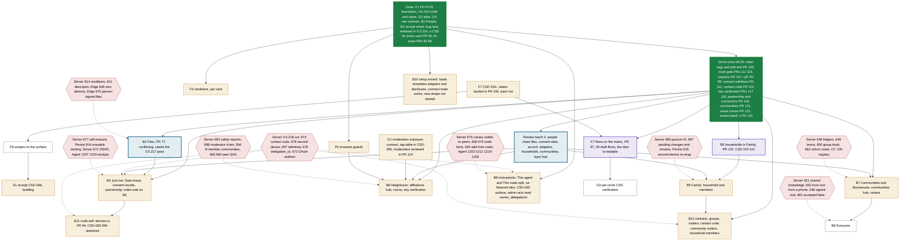

# Locked Spec: roadmap

The order the client redesign is built in, and where it stands. **Updated 2026-09-28.**

This file is the plan. It tracks dependencies, not dates. The two Gantt artifacts were deleted,
and the plan now lives here and in backlog issue #71. The Card Atlas, the execution plan and the
handoff are still the design's own documents; this page records only what order they are built in
and how far along each part is. The item IDs (F, S, N, B, G) are the execution plan's.

## Where we are

- **Released:** client **0.5.224** is still the latest tag; it carries the whole bug lane, and
  CIRISAgent#1184 (server 0.5.217 plus client 0.5.224) merged green. Everything below landed on
  `main` after that tag and ships with the next cut. Server **0.5.217** is the latest server
  release; **0.5.218 is not cut** (see upstream).
- **72 CSDs on `main`** (`FSD/CSD`), up from 61 in #90: **64 building, 7 sketched, 1 envisioned**,
  none `testable` yet. What changed since 2026-09-25:
  - **New cards:** the six Network tiles (CSD-032 identity, 033 peers, 046 trust graph, 047 content,
    048 interfaces, 049 queue; #124), the three 0.5.218 cards (092 share contact code, 093 show
    approval code, 094 approve a new device; #98), communities (102, 103, 110; #121) and key
    verification (104; #117). CSD-045 (this node's own standing) went from envisioned to building
    with a surface (#124). CSD-100/101 (household, household members) are on #122.
  - **Retired by the dedup rule** ("one card per thing it does"): CSD-001 Delegation folded into
    055 Delegations; System's pause/resume folded into 024 Runtime; SkillImport into 015 Skills;
    the Map tile into 046 (CSD-034 was reserved for it and is left unused). CSD-105/106 (erase
    traces, deletion receipts) were dropped for rows on 039 Data (#123); CSD-107 (partnership
    decisions) and 108 (connectors) were dropped for §7 of 054 Consent and 020 Adapters (#120).
  - **Still sketched:** 037 My Identity, 042 Help, 044 Health & Reputation, 054 Consent, and
    092–094, which cannot go further until server 0.5.218 exists. **Envisioned:** 030 Telemetry.
- **Merged since #90** (2026-09-26 → 28), in three shapes:
  - **Cards and fixes:** #99 a real QR encoder and scanner; #112 withdraw consent (Revoke on Manage
    Consent, Remove on People); #113 share my contact code, add a contact by scan or paste; #117/#118
    the key-verification ceremony on the peer detail; #120 partnership decisions on Consent and
    connectors on Adapters; #121 communities and affiliations on the Neighbours and Communities hubs,
    rosters in People, rooms in Chats; #123 erase an agent's traces and check a deletion receipt on
    Data; #125 two CI flakes that were real bugs.
  - **The checks that keep the CSDs honest:** #100 tags every card's loading / empty / error / list
    state and a test keeps CSDs and code from drifting (F7's `states:` half); #107 cites the routes
    cards already call, verified by call site (28 CSDs); #106 the accord cards are the trust root;
    #111 + #119 `check_csd_routes.py`, cards keyed by the routes they call, CSD §3 generated from
    code. **Route gate on `main`: uncited routes 121 → 14, duplicate mutating routes 26 → 23,
    baseline current**, exit 0.
  - **Two integration merges**, because every pair of client PRs conflicts on the vendoring digest
    line: **#115** carried #100, #101 (the People receipt reads the grant envelope), #107 and #112,
    with #116 as its seven review findings; **#124** is **batch 1 of the gap-closing review** —
    runtime, identity, interact, setup, network, moderation — each group reviewed against the CSDs,
    the node/agent APIs and the CC. Headlines: the setup wizard loads templates, adapters and the tool
    disclosure and connect-node works; Login's 23 post-login routes are attributed to the cards they
    feed; sign-in state is read; This node › Config edits the node; Transport writes typed values;
    Runtime reads the step response; admin acts take the node's `owner_delegations`; error never
    renders as empty across all six groups. Drivable offenders 172 → 151; `:shared:desktopTest`
    1081/1081.
- **In review, three PRs:**

  | PR | what | state |
  |---|---|---|
  | #77 | B3 Files: Files holds files, Notes to self in Just me › Chats | **conflicting**; checks green on its own base; needs the 0.5.217 pass below, and `FSD/CSD/PENDING-CSD-007.md` holds the §3 rows to apply when it lands |
  | #97 | CSD flows run on the five-platform matrix; `state:` now asserts something | mergeable; the localization + vendoring check is red; this is the path from `building` to `testable` (28 draft flows under `testing/flows/drafts/`) |
  | #122 | households in the Family hub, members on Family › People (CSD-100/101) | mergeable, checks green; asks for edits to CSD-050, 005 and 007 |

- **Next: batch 2 of the gap-closing review** — people/chats/files, consent/data, accord, adapters,
  households, communities, layer hub — the same shape as #124: each group against its CSDs, the APIs
  and the CC, integrated as one merge. Then B3 (#77) after its 0.5.217 pass, then B4 Just me closes.
- **The circles are no longer strictly sequential.** The plan was B3 → B4 → … → B8 one circle at
  a time. What actually happened: the node shipped households and communities (0.5.216) and the
  client took them where they belong — Family (#122), Neighbours and Communities (#121) — while
  Files (#77) sat conflicting. So B5, B6 and B7 are each partly built ahead of B3 and B4. The graph
  below shows what still has to come before what; it no longer pretends the circles are a chain.
- **CIRISAgent#1213 is closed** (2026-09-26): the agent proxies the node's prefixes, and the client
  routes node-owned calls to the node URL anyway. It was the one upstream item that reached every
  lane; nothing has taken its place. **The nearest thing is the 0.5.218 cut**, which four merged
  cards and three sketched CSDs are built against.

## Dependencies

Arrows read "must come before". Upstream items (red hexagons, dotted arrows) are what another repo
still owes: the lane can start, but can't fully close without it. Done work is folded into the two
green boxes.

```mermaid
flowchart TD
    classDef done fill:#1D7F45,stroke:#1D7F45,color:#fff
    classDef part fill:#F8EEDC,stroke:#B8791C,color:#000
    classDef todo fill:#fff,stroke:#6E6875,color:#000
    classDef next fill:#E3EEF3,stroke:#2B6E8C,stroke-width:3px,color:#000
    classDef review fill:#EDE7F6,stroke:#5B4FC0,stroke-width:2px,color:#000
    classDef up fill:#F6E2E2,stroke:#B23A3A,color:#000

    BASE["Done: F1 F3 F4 F5 foundation, N1-N10 shell and spine, G2 atlas, G4 nav contract, B1 People, B2 receipt sheet, bug lane released in 0.5.224, a CSD for every card PR 90, fix wave PRs 92-95"]:::done
    WAVE["Done since 09-25: state tags and drift test PR 100, route gate PRs 111 119, citations PR 107, QR PR 99, consent withdraw PR 112, contact code PR 113, key verification PRs 117 118, partnership and connectors PR 120, communities PR 121, erase traces PR 123, review batch 1 PR 124"]:::done
    REV2["Review batch 2: people chats files, consent data, accord, adapters, households, communities, layer hub"]:::next
    B3["B3 Files, PR 77, conflicting, needs the 0.5.217 pass"]:::next
    HH["B5 households in Family, PR 122, CSD-100 101"]:::review
    FLOWS["F7 flows on the matrix, PR 97, 28 draft flows, the door to testable"]:::review
    F2["F2 renderers, per card"]:::part
    F6["F6 invariant guards"]:::part
    F7["F7 CSD DSL: states landed in PR 100, each not"]:::part
    F8["F8 scopes on the surface"]:::todo
    S1["S1 receipt CSD-006, building"]:::part
    G1["G1 moderation exposure contract, tag table in CSD-065, moderation reviewed in PR 124"]:::part
    B4["B4 Just me: Data erase, consent revoke, partnership; notes wait on B3"]:::part
    B5["B5 Family: household and members"]:::part
    B6["B6 Neighbours: affiliations hub, rooms, key verification"]:::part
    B7["B7 Communities and Businesses: communities hub, rosters"]:::part
    B8["B8 Everyone"]:::todo
    B9["B9 instruments: This agent and This node split, six Network tiles, CSD-045 surface, admin acts read owner_delegations"]:::part
    B10["B10 setup wizard: loads templates adapters tool disclosure, connect-node works; new shape not started"]:::part
    B11["B11 multi-self: devices in PR 94; CSD-093 094 sketched"]:::part
    B12["B12 contacts, groups, rosters: contact code, community rosters, household members"]:::part
    G3["G3 per-circle CSD verification"]:::todo

    SRV218{{"Server 0.5.218 cut: 673 contact code, 678 second device, 657 withdraw, 676 delegation_id, 672 OAuth redirect"}}:::up
    UB3{{"Server 614 renditions, 641 descriptor, Edge 646 own devices, Edge 675 person-signed files"}}:::up
    UB5{{"Server 686 quorum M, 687 pending changes and rename, Persist 916 second-device re-wrap"}}:::up
    UB6{{"Server 665 safety reports, 688 moderator chain, 594 N-member communities, 683 684 peer SAS"}}:::up
    UB7{{"Server 648 ledgers, 649 terms, 650 group book, 662 cohort roster, CC 105 registry"}}:::up
    UB8{{"Server 651 shared knowledge, 652 trust root from a phone, 248 signed root, 681 accepted false"}}:::up
    UERA{{"Server 677 self-erasure, Persist 914 erasable minting, Server 671 DSAR, Agent 1207 1220 receipts"}}:::up
    USELF{{"Server 675 canary visible to peers, 668 670 node facts, 694 add-from-code; Agent 1202-1212 1219-1226"}}:::up

    BASE --> WAVE
    WAVE --> REV2 & B3 & HH & FLOWS
    BASE --> F2 & F6 & B9 & B10
    WAVE --> B4 & B6 & B7 & B12
    B3 --> B4
    HH --> B5 --> B12
    REV2 --> B4 & B5 & B6 & B7
    B7 --> B8
    F7 --> FLOWS --> G3
    F7 --> F8 --> S1
    G1 --> B6
    F6 --> B6
    B4 --> B11
    SRV218 -.-> B4 & B9 & B11 & B12
    UB3 -.-> B3
    UB5 -.-> B5
    UB6 -.-> B6
    UB7 -.-> B7
    UB8 -.-> B8
    UERA -.-> B4
    USELF -.-> B9
```

Green = done · purple = in review · amber = partial · blue outline = next · white = not started ·
red hexagon = owed upstream.

## Plan against actual

| | item | status | where |
|---|---|---|---|
| F1, F3, F4, F5 | namespace table, tokens + lint, glyphs, primitives | **done** | #62 |
| F2 | eleven renderers | partial: the enum and mapping exist; composables are written per card | #62 |
| F6 | invariant guards | partial | #62 |
| F7 | CSD DSL (`state`, `each`) | partial: `states:` is in every CSD, tagged in code, with a drift test; flows assert it on the matrix in #97; `each` not started | #100, #97 |
| F8 | `scopes:` on the surface | not started. Meanwhile `check_csd_v3` rejects unknown surface keys and checks `flow_only` | #90 |
| N1–N10 | nav tree, rail, tabs, gating deleted, the spine | **done** | #63, #64 |
| S1 | receipt CSD | **building** (CSD-006); the People receipt reads the grant envelope, 5 of 5 facts | #101 |
| S2 | moderation CSD | **building** (CSD-065, with G1's tag table); reviewed in batch 1 | #90, #124 |
| S3–S7 | card CSDs | **72 on main**: 64 building, 7 sketched, 1 envisioned; §3 generated from code by the route gate; citations verified by call site | #90, #107, #111, #124 |
| B1, B2 | People, receipt sheet | **done** | #62 |
| B3 | Files | in review, conflicting, needs the 0.5.217 pass; §3 rows waiting in `PENDING-CSD-007.md` | #77 |
| B4 | Just me | partial: erase traces and deletion receipts on Data, Revoke on Manage Consent, partnership decisions on Consent; notes to self wait on #77; the circle closes after review batch 2 | #123, #112, #120 |
| B5 | Family | in review: the household in the Family hub, members on Family › People | #122 |
| B6 | Neighbours | partial: affiliations on the hub, rooms in Chats (CSD-110), key verification on the peer detail; Safety still has nothing a non-duty-holder may do | #121, #117 |
| B7 | Communities and Businesses | partial: the community itself (Rules), rosters (People), rooms (Chats); ledgers, terms and the group book are upstream | #121 |
| B8 | Everyone | not started | — |
| B9 | instruments | partial: This agent / This node split merged; six Network tiles have CSDs and the review; CSD-045 has a surface; Config edits the node; admin acts read `owner_delegations` (0.5.218) | #93, #124 |
| B10 | setup wizard, new shape | partial: the wizard loads templates, adapters and the tool disclosure, connect-node works, one press runs the final step once; the new shape is not started | #92, #124 |
| B11 | multi-self | partial: device labels, revoked devices, release a node; CSD-093/094 sketched against 0.5.218 | #94, #98 |
| B12 | contacts, groups, rosters | partial: share my contact code, add by scan or paste (0.5.218), community rosters, household members in #122 | #113, #121, #122 |
| G1 | moderation exposure contract | partial: tags specified in CSD-065; moderation reviewed in batch 1; not yet a surface | #90, #124 |
| G2, G4 | atlas; nav contract | **done** | #64 |
| G3 | per-circle CSD verification | in review as the flow runner: 28 draft flows, one per CSD that has one, none live until #97 merges and a flow goes green on the matrix | #97 |
| — | gap-closing review, batch 1 | **done**: runtime, identity, interact, setup, network, moderation | #124 |
| — | gap-closing review, batch 2 | **next**: people/chats/files, consent/data, accord, adapters, households, communities, layer hub | — |

## Upstream: what each lane is waiting on

Grouped by the lane the client work sits in. Numbers are issues; the first table row is the one that
gates four merged cards. The 2026-09-25 list, with verification, is in #90's body; the batch-1
review filed CIRISAgent#1223–1226 and CIRISServer#692, #694; the card PRs filed the rest.

| lane | owed | issues |
|---|---|---|
| **the 0.5.218 cut** (server 0.5.217 is latest) | a person's contact code; a second device that opens old files and replicates; withdraw a `consent:replication` grant; the owner's `delegation_id` on the wire; the OAuth redirect check | **Server#673, #678, #657, #676, #672**; also on the slate: #655 (occurrences unauthenticated), #646/#647/#622 (replication kinds, family cohort, cohort blob) |
| people / chats / files | renditions and the file descriptor; bytes on your own devices; files signed by the person; peer SAS that can match, and a record when it doesn't; a list of peering grants; rooms after a restart; self-room state that survives a reboot | Server#614, #641, #683, #684, #680, #623, #630; Edge#646, #675; Persist#919; Agent#1210 |
| consent / data | erase yourself from the app; erasable minting; DSAR without an agent; a DSAR receipt; deletion receipts across a key rotation; consent that speaks scopes; `consent:scope:analyze` readable; erase-traces returns its audit row | Server#677, #671, #685, #659, #661; Persist#914; Agent#1207, #1212, #1219, #1220, #1204, #1221 |
| households / communities | absolute-M quorum; pending quorum changes and rename; N-member communities above the substrate; a cohort-scoped roster read; claim into all seven cohort scopes; a founder can appoint a moderator; ledgers, terms, the group book; a non-duty-holder can report; the missing registry families | Server#686, #687, #594, #662, #666, #688, #648, #649, #650, #665; Persist#916; CC#105, #109, #110; Agent#1205 |
| accord / trust root | a signed trust root; re-rooting from a phone; `accepted:false` for the root the node is under; supersede names a route that exists; a Wise Authority surface for owner recovery; the lineage-head cosign | Server#248, #652, #681, #682, #664, #693, #536, #537; Persist#809, #937–#939; CC#118–#121, #127 |
| node ops (This node) | the compulsion declaration visible to peers; two node facts with no node route; the transport key on identity; a bare node can take a node code; a config cohort envelope; an audit read; run-without-AI reported as such; deferrals on the node | Server#675, #668, #670, #694, #660, #658, #656, #574, #573, #669, #547 |
| agent surfaces (This agent) | users without emails; skill import that fails closed; a WA "modify" that is a rejection; inventory reads that match the card; what the agent thinks with, readable; connectors that report honestly and record a delegation; tickets that check transitions; wallet idempotency; billing that doesn't invent credits | Agent#1202, #1203, #1206, #1208, #1209, #1211, #1222, #1223, #1224, #1225, #1226, #945 |
| setup / identity | is a remote node already owned; a dedicated home with a dedicated identity; a TPM that isn't silently software; a pre-#659 key row detected; device-grant chains; idempotent setup/complete; `claim_pin_file` on setup status | Server#667, #621, #639, #608, #595, #490, #663; Agent#1193–#1196, #1110, #1123, #1152 |

**Closed since 2026-09-25:** CIRISAgent#1213 (the proxy gap that reached every lane),
CIRISPersist#907 (late members) and #910 (family roster replication), CIRISConstitution#106–#108.
Client #108 and #109 (vocabulary and operations from the node) closed in #124.

**Shipped upstream and now used by the client:** households (#122, in review), communities and
rooms (#121), drive CRUD only through #77, peer key verification (#117), trace erasure (#123),
`/v1/vocabulary` and `/v1/operations` (#124), the Tier S self-standing routes (CSD-045, #124).
**Still shipped and unused:** `/v1/media/policy` and content digests (both in #77's pass),
`GET /v1/files/{id}/meta`, rename, move.

## Client backlog outside the lanes

- Open since the bug lane: #50 (iOS SIGABRT; 0.5.224 writes a Kotlin crash log to read on the
  next failure), #51 (logout on a phone with no agent; addressed by #64, needs a phone check), #39,
  #33, #65 and #78 (bundle keys for 0.5.215/0.5.216; the routes are now called, the ids are not
  all bundled).
- **Transferred in from CIRISServer (#80–#89, #91):** stale LLM checks, the dead-`:8080` Play
  Integrity post, failing vendored unit tests, English picker titles, the FOREIGN_ALPHABET ratchet,
  node trust from CEG state, the test-automation audit, the §4.5.13 reveal loop and content hooks,
  secure storage surviving an identity wipe, and the mesh app parity item (#88). Not yet triaged
  into lanes.
- **Filed from the CSD and review work:** #96 (Announce step copy), #102 (nothing signs the 29
  locale bundles), #103 (CSD-037 fields rendered, still tagged `proposed:`), #104 (Help shows the
  app's version, never the node's), #105 (Health & Reputation reads the same in two circles),
  #110 (Login infers instead of reading `signin-state`; batch 1 reads it, the issue stays open
  until the card is re-checked), #114 (rc5: the reference matcher into `check_csd_v3`).
- From the CSDs, not yet in a PR: Account vs Settings (a separate `Screen.Account`), about 150
  text fields without an input sink (drivable offenders 151 after #124), the households dispatcher
  split named in #122, and the six sketched cards above.

## B3: one pass before merge

Server 0.5.217 changed what #77 should do, and it has been conflicting since #90 landed:
1. The write gate refuses a file whose bytes contradict its declared type, including a real JPEG
   sent as `application/octet-stream`. That is what #77 sends when a picker reports no type. Fix:
   declare the type sniffed from the bytes.
2. Uploads go up to 64 MiB. Read the caps from `/v1/media/policy`, not the compiled-in 1 MiB.
3. `content_digest` is on the open-file response, so verify it (CC 5.3.2.5) before anything renders.
4. Name the note-only `unreadable` state.
5. ~~Route drive and notes calls to the node URL~~ — CIRISAgent#1213 is closed; the client routes
   node-owned calls to the node URL regardless (the way #123 does).
6. Bundle the 0.5.216 and 0.5.217 message ids (#78; #65 is already in #77).
7. Apply the rows in `FSD/CSD/PENDING-CSD-007.md` to CSD-007 §3 and delete that file in the same
   commit; take #122's note that Family › Files can list once households exist.

## Deferred on purpose

- Geist / Geist Mono: the type scale ships on system faces until compose-resources fonts are proven
  on the iOS leg.
- The 13 accent themes stay until the per-circle work decides what to do with them.
- Image, audio and video previews: renditions only (`FSD/MEDIA_EDGE.md` §7), after CIRISServer#614.
